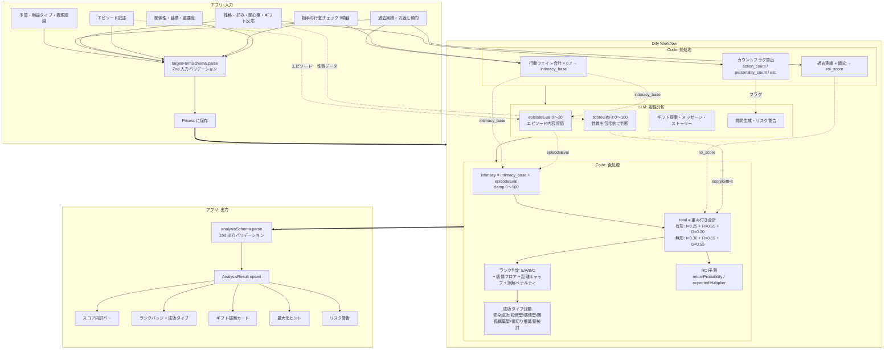

# ValenTactics

バレンタインギフト戦略を AI で最適化するアプリケーション。  
「誰に・何を・どう渡すか」を、3 軸スコアリング + Dify ワークフローで分析し、**ユーザーの利益（有形 / 無形）を最大化**する投資判断を提案する。

---

## 技術スタック

| レイヤー | 技術 |
|---|---|
| フレームワーク | Next.js 15 (App Router / TypeScript) |
| UI | Tailwind CSS 4 + shadcn/ui + Recharts |
| フォーム | React Hook Form + Zod 4 |
| DB | PostgreSQL (Supabase) + Prisma 7 |
| 認証 | Supabase Auth |
| AI 分析 | Dify Workflow (GPT-4o) |
| ローカル分析 | Dify フォールバック用の確定計算ロジック |

---

## ディレクトリ構成

```
src/
├── actions/         # Server Actions（create+analyze, update+analyze, delete）
├── app/
│   ├── api/targets/ # GET のみの API Routes（一覧・詳細取得）
│   ├── targets/     # 一覧 / 詳細 / 新規登録 / 編集ページ
│   └── login/       # ログインページ
├── components/      # UIコンポーネント（target-form 等）
├── lib/
│   ├── types.ts     # 型定義 + 定数配列
│   ├── analysis.ts  # ローカルフォールバック分析ロジック
│   ├── dify.ts      # Dify API クライアント
│   ├── prisma.ts    # Prisma クライアント
│   └── supabase/    # Supabase クライアント
├── schema/
│   ├── target-form.ts  # フォーム入力バリデーション（Step 1〜4）
│   ├── analysis.ts     # 分析結果バリデーション
│   └── index.ts        # barrel export
└── generated/       # Prisma 生成コード
dify/
└── valentine-analysis.yml  # Dify ワークフロー DSL
docs/
├── RD.md            # 要件定義書
└── score.md         # スコアリング定義書
```

---

## セットアップ

```bash
# 依存インストール
npm install

# 環境変数を設定
cp .env.example .env
# .env を編集して Supabase / Dify の値を設定

# DB マイグレーション
npx prisma migrate deploy
npx prisma generate

# 開発サーバー起動
npm run dev
```

### 環境変数

| 変数 | 説明 |
|---|---|
| `DATABASE_URL` | Supabase Transaction mode pooler |
| `DIRECT_URL` | Supabase Direct connection（マイグレーション用） |
| `NEXT_PUBLIC_SUPABASE_URL` | Supabase プロジェクト URL |
| `NEXT_PUBLIC_SUPABASE_ANON_KEY` | Supabase Anon Key |
| `DIFY_API_URL` | Dify API ベース URL（`https://api.dify.ai`） |
| `DIFY_API_KEY` | Dify Workflow の API Key |

---

## アーキテクチャ

### データフロー全体像



### 設計原則

- **LLM に算数をさせない**: 数値計算（スコア合算・ランク判定・ROI 予測）は全て Code ノードで確定計算
- **LLM は定性判断のみ**: エピソード評価・戦略適合度・文章生成を担当
- **入出力を Zod で検証**: Server Action で入力（`targetFormSchema`）と出力（`analysisSchema`）の両方をバリデーション
- **Dify 障害時フォールバック**: ローカル分析ロジック (`src/lib/analysis.ts`) で最低限の結果を保証

---

## スコアリングモデル

### 3 軸スコア（各 0〜100）

| 軸 | 計算主体 | データソース |
|---|---|---|
| **親密度 (Intimacy)** | Code（前処理 + 後処理） | 行動チェック 9 項目 × 0.7 + エピソード評価(LLM) + 過去やり取り |
| **ROI** | Code（前処理） | 過去お返し実績 + 返礼倍率 + お返し傾向補正 |
| **戦略適合度 (GiftFit)** | LLM | 性格・好み・関心事・エピソード・行動を包括的に判断 |

### 総合スコア

| 利益タイプ | 親密度 | ROI | 戦略適合度 |
|---|---|---|---|
| 有形 | 25% | **55%** | 20% |
| 無形 | 30% | 15% | **55%** |

### ランク判定

| スコア | ランク | 説明 |
|---|---|---|
| ≧80 | S | 最優先投資対象 |
| ≧60 | A | 重要対象 |
| ≧40 | B | 標準対応 |
| <40 | C | 最小限 / 見送り検討 |

**補正ルール:**
- 感情フロア: `emotionalPriority ≧ 5` → 最低 A / `≧ 4` → 最低 B
- 距離キャップ: `距離を置きたい` + `重要度 ≦ 2` → 上限 B
- 本命誤解ペナルティ: `本命と受け取られる可能性あり` + 恋愛対象外 → 1 段階ダウン

### 成功タイプ分類

| タイプ | 条件 |
|---|---|
| 📈 完全成功 | 有形 + ROI ≧ 60 + 重要度 ≧ 4 |
| 💰 投資型 | 有形 + ROI ≧ 50 |
| 💝 感情型 | 無形 + 重要度 ≧ 4 |
| 🤝 関係構築型 | 無形 + 親密度 ≧ 50 |
| ✂️ 損切り推奨 | 距離を置きたい + 重要度 ≦ 2 |
| 🔍 要検討 | 上記いずれにも該当しない |

---

## Dify ワークフロー

DSL ファイル: `dify/valentine-analysis.yml`

Dify 管理画面の「ワークフローをインポート」から読み込む。

### ワークフロー構成

```
Start(20入力変数) → Code(前処理) → LLM(定性分析) → Code(後処理) → End(16出力)
```

| ノード | 役割 | 出力 |
|---|---|---|
| **Code: 前処理** | 確定計算: intimacy_base, roi_score, カウントフラグ | 9 項目 |
| **LLM: 定性分析** | エピソード評価, 戦略適合度, 文章生成 | JSON (10 項目) |
| **Code: 後処理** | 最終スコア合算, ランク補正, 成功タイプ, ROI 予測 | 16 項目 |

---

## 関連ドキュメント

- [要件定義書](docs/RD.md)
- [スコアリング定義書](docs/score.md)
